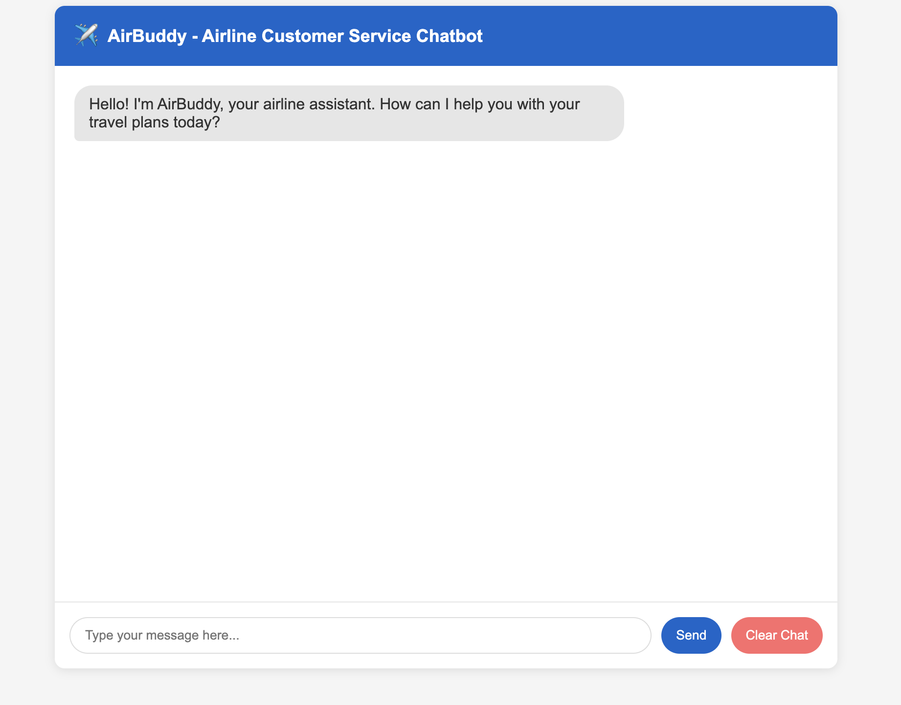

# Airline LLM Chatbot - AirBuddy

An intelligent airline customer service chatbot built with Python, FastAPI, and NVIDIA's LLaMa 3.3 Nemotron Super 49B via OpenRouter API, featuring conversation memory systems, natural language understanding, and a responsive web interface using HTML/CSS/JavaScript and Jinja2 templates.

## 📷 Screenshot


*Add a screenshot of your chatbot interface here once it's running*

## ✨ Features

- 🤖 Powered by NVIDIA's LLaMa 3.3 Nemotron Super 49B model
- 💬 Maintains conversation history and context
- ✈️ Specialized in airline industry knowledge
- 🧠 Extracts and remembers key travel information (flights, dates, destinations)
- 🌐 Easy-to-use web interface
- 📋 Structured conversation menu system
- 🔄 Ability to clear conversation history

## 🛠️ Tech Stack

- **Backend**: Python, FastAPI
- **Frontend**: HTML, CSS, JavaScript
- **Templates**: Jinja2
- **AI Model**: NVIDIA's LLaMa 3.3 Nemotron Super 49B via OpenRouter API
- **Memory System**: Custom conversation tracking
- **Text Processing**: Regular expressions, natural language understanding

## 🚀 Setup Instructions

1. Clone the repository:
   ```bash
   git clone https://github.com/GopalGB/Airline_LLM_Chatbot_Llama.git
   cd Airline_LLM_Chatbot_Llama
   ```

2. Create a virtual environment:
   ```bash
   python -m venv venv
   ```

3. Activate the virtual environment:
   - On Windows: `venv\Scripts\activate`
   - On macOS/Linux: `source venv/bin/activate`

4. Install dependencies:
   ```bash
   pip install -r requirements.txt
   ```

5. Create a `.env` file and add your OpenRouter API key:
   ```
   OPENROUTER_API_KEY=your_openrouter_api_key_here
   ```

6. Run the application:
   ```bash
   python -m app.main
   ```

7. Open your browser and navigate to `http://localhost:8000`

## 💡 Usage

1. Open the chatbot interface in your browser
2. Choose from the menu options or type your airline-related question
3. Interact with AirBuddy to get help with flight bookings, check-ins, baggage policies, and more
4. Use the "Clear Chat" button to start a new conversation

## 👨‍💻 Development

This project is structured as follows:
- `app/` - Main application directory
  - `api/` - API endpoints
  - `core/` - Core configurations
  - `memory/` - Conversation memory system
  - `models/` - Chatbot logic
  - `templates/` - HTML templates
  - `utils/` - Utility functions
  - `main.py` - Application entry point

## 📝 License

This project is open source and available under the MIT License.

## 🔗 Repository

[https://github.com/GopalGB/Airline_LLM_Chatbot_Llama](https://github.com/GopalGB/Airline_LLM_Chatbot_Llama)